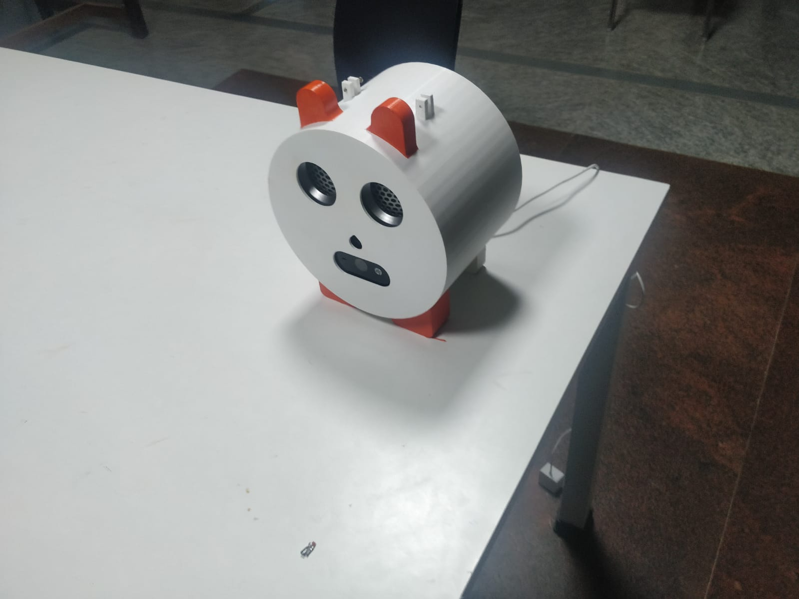
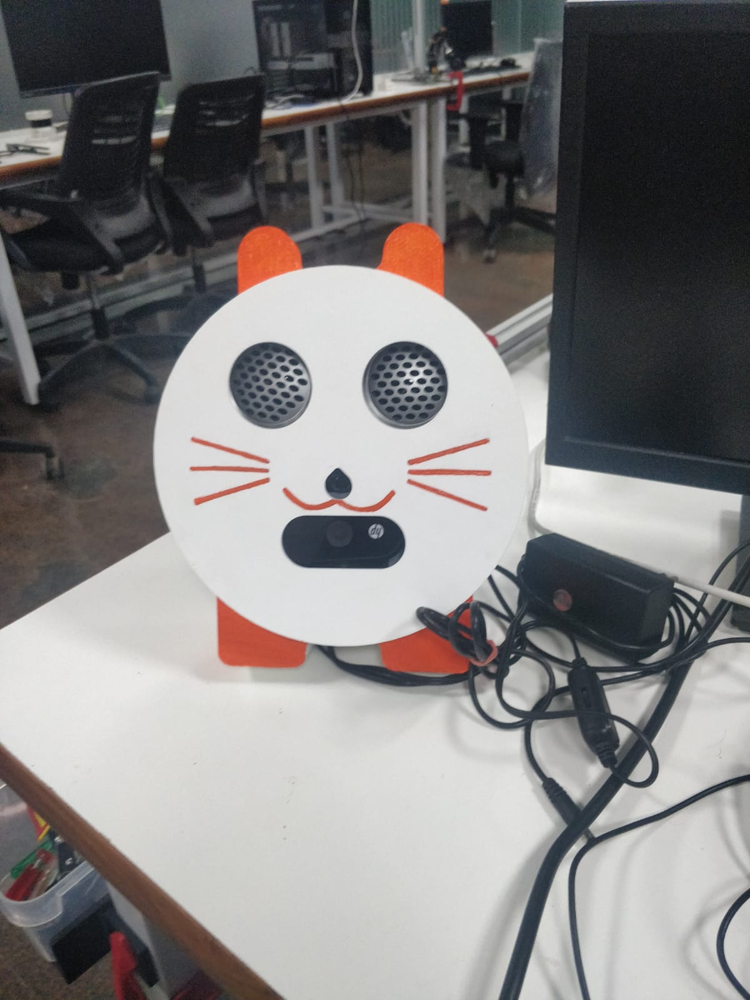
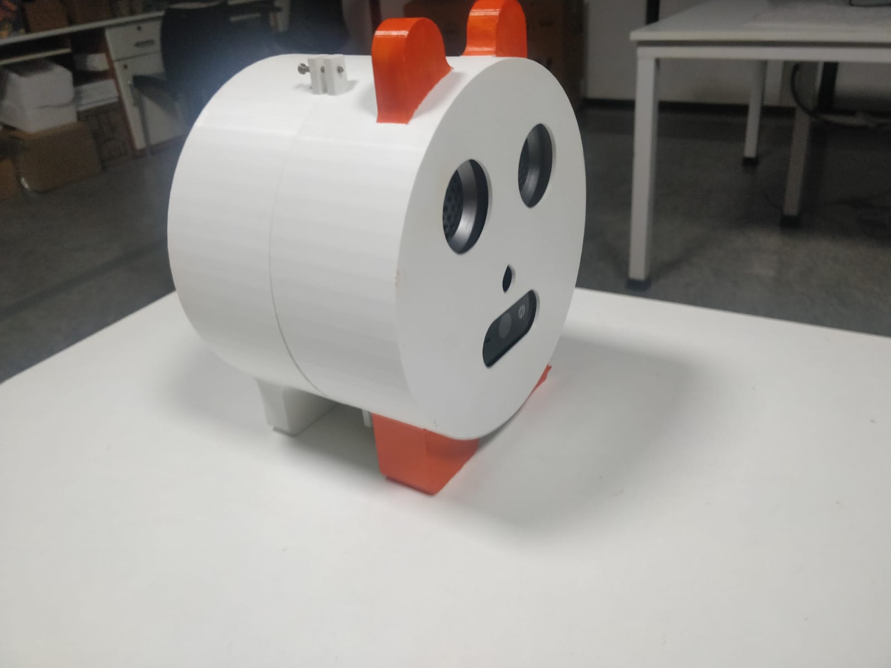
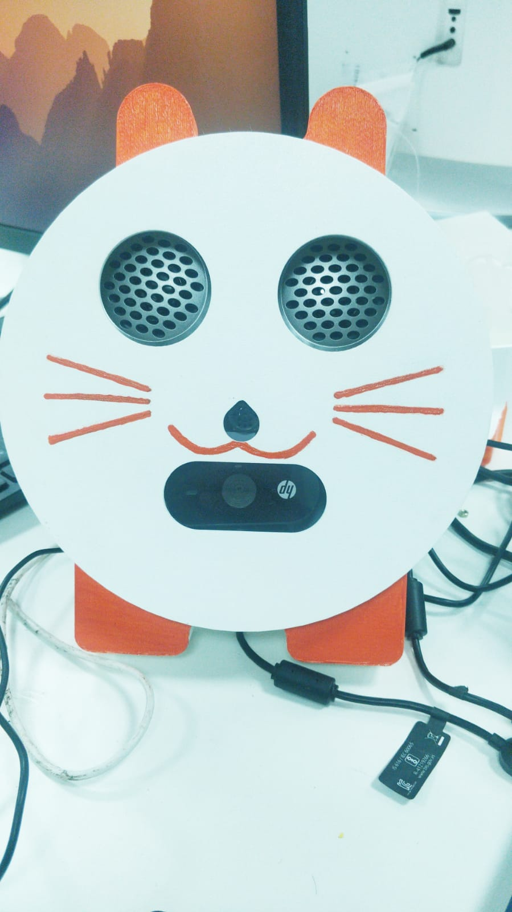
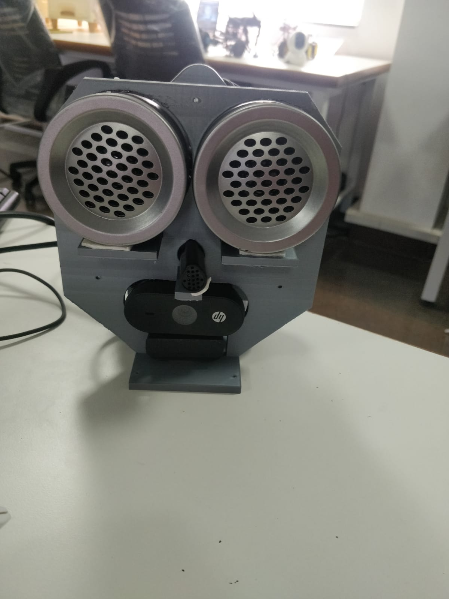

# AI Fall Detector for Raspberry Pi 4 (Mediapipe)

This repository contains a real-time Fall Detection system built for the Raspberry Pi 5. It leverages the Hailo-8L AI HAT for hardware-accelerated pose estimation (`yolov8s_pose`), utilizing a connected USB camera and speaker for alerts.

## 📦 Hardware Requirements
*   **Raspberry Pi 5** (4GB or 8GB recommended)
*   **USB Web Camera**
*   **Speaker / Audio Output** (3.5mm jack, USB, or HDMI)

## 🖥️ Software & System Requirements
*   **OS:** Raspberry Pi OS (64-bit, Bookworm based)
*   **Python:** Python 3.11+ (Default on Bookworm)

